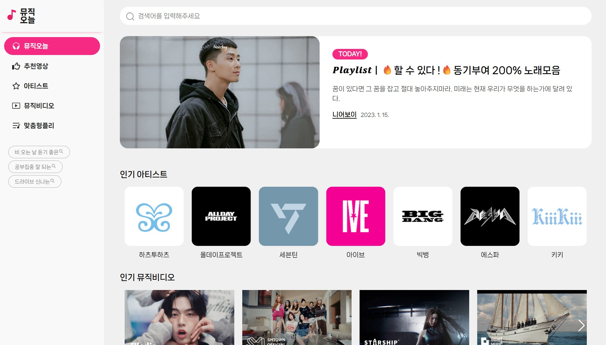

# 📺 오늘뮤직 - 유튜브API를 활용한 음악영상 웹
<div align="center">
  <a href="https://todayms.netlify.app" target="_blank" rel="noopener noreferrer">
    
  </a>
</div>


---
  
## 주요 기능

- 실시간 음악 영상 검색
- 음악 영상 재생
- 채널 정보 제공
- 음악영상 추천


---

## 🛠 사용 기술

- React, Axios, Sass, Swiper, React Helmet Async, React Player

---

## 📌특징

- axios 전역 설정으로 외부API 기본 URL과 인증 헤더를 중앙화
- Swiper.js 기반 슬라이더로 추천 콘텐츠 탐색 구현
- React Helmet Async로 페이지별 title과 meta 태그를 props 기반으로 동적 관리해 SEO 최적화/유지보수

---

## 📁 폴더 구조
```
C:.
├─assets
│  ├─fonts
│  ├─img
│  │  ├─artist
│  │  ├─icon
│  │  ├─mv
│  │  └─pl
│  └─scss
│      ├─section
│      └─setting
├─components
│  ├─contents
│  ├─header
│  ├─section
│  └─videos
├─data
├─pages
└─utils
│  │  ├─mv
│  │  └─pl
│  └─scss
│      ├─section
│      └─setting
├─components
│  ├─contents
│  ├─header
│  ├─section
│  └─videos
├─data
├─pages
└─utils

```

## 🔧 주요 개선 사항

### ✅ axios 전역설정으로 중앙화

- **구조 개선**
    - BASE_URL 와 options를 정의해 공통설정 중앙화 
    - 외부 api호출을 담당하는 함수 fetchFromAPI함수
    - 인자로 받은 url을 BASE_URL뒤에 붙여 요청URL 생성

- **성과**
    - 모든 요청이 동일한 인증방식과 url기준으로 실행되어 **버그발생 가능성 감소**
    - 여러 컴포넌트에서 동일한 axios인스턴스 사용가능으로 **코드 재사용성 최적화**

<br/>


### ✅ React Router + lazy + Suspense 적용으로 코드 스플리팅 구현

- **구조 개선**
    - React.lazy()를 활용해 각 페이지 컴포넌트를 동적 import 방식으로 분리
    - Suspense를 통해 비동기 로딩 중 fallback UI 제공
    - React Router의 Routes 기반 라우팅 구조에 적용

- **성과**
    - 초기 번들 크기를 줄여 첫 화면 로딩 속도 개선,사용자 경험 향상
    - 필요할 때만 로드하는 구조로 리소스 낭비 최소화

<br/>


