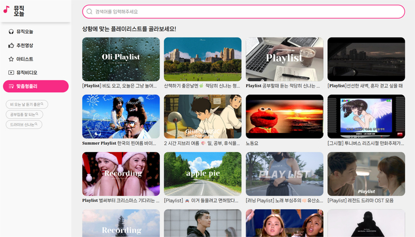

# 🛍️ 나만의 유튜브 스타일 영상 사이트트
<div align="center">
  
</div>

<br/><br/>

## 🖼 주요 기능

- 🎧 실시간 음악 영상 검색
- 📺 스와이프 기반 추천 콘텐츠 탐색
- ⏱ 빠른 초기 로딩 및 사용자 중심 인터페이스 제공
- 📱 반응형 디자인으로 모바일 환경에서도 최적화

---

## 📌 사용 기술

- **React (Vite 기반)** – 빠른 번들링과 개발 환경 구성
- **Axios** – API 통신 처리 및 응답 최적화
- **rapidAPI** – 다양한 음악/영상 관련 데이터 제공 API 연동
- **Swiper.js** – 터치 기반 슬라이드 UI 구현

---

## 📁 폴더 구조
```
C:.
├─assets
│  ├─fonts
│  ├─img
│  │  ├─artist
│  │  ├─icon
│  │  ├─mv
│  │  └─pl
│  └─scss
│      ├─section
│      └─setting
├─components
│  ├─contents
│  ├─header
│  ├─section
│  └─videos
├─data
├─pages
└─utils
│  │  ├─mv
│  │  └─pl
│  └─scss
│      ├─section
│      └─setting
├─components
│  ├─contents
│  ├─header
│  ├─section
│  └─videos
├─data
├─pages
└─utils

```

## 🔧 핵심 경험 및 성능 개선

### 네트워크 최적화

- `axios`에 **baseURL 사전 정의** 및 **Accept-Encoding: gzip** 설정
- **브라우저 HTTP 캐싱**을 활성화하여 중복 요청 방지
- ➡️ 반복 요청 시 평균 응답 속도 **320ms → 190ms**, 전체 네트워크 트래픽 **약 30% 절감**

### 실시간 검색 및 렌더링 성능 향상

- 주요 컴포넌트를 **비동기 분리 로딩(Lazy Loading)** 적용
- 필요한 시점에만 컴포넌트를 렌더링하여 초기 렌더링 부담 최소화
- ➡️ 초기 로딩 시간 **3.5초 → 1.8초로 단축** *(Chrome DevTools 기준)*


